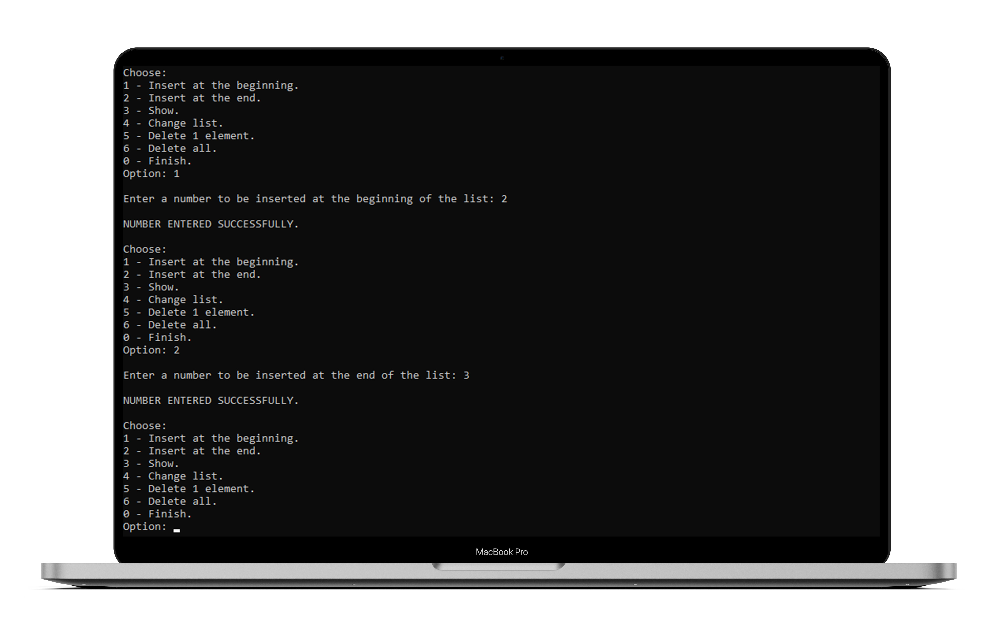
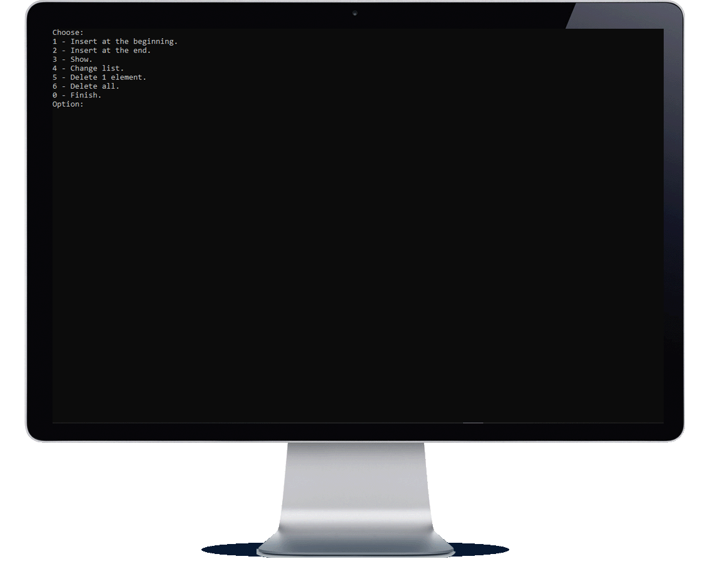

<h1 align="center">Lista simplesmente encadeada</h1>

    <a title="Sobre" href="#-sobre">Sobre</a>&nbsp;&nbsp;•&nbsp;&nbsp;  
    <a title="Funcionalidades" href="#%EF%B8%8F-funcionalidades">Funcionalidades</a>&nbsp;&nbsp;•&nbsp;&nbsp;
    <a title="Tecnologias" href="#-tecnologias-utilizadas">Tecnologias</a>&nbsp;&nbsp;•&nbsp;&nbsp;
    <a title="Funcionamento" href="#-funcionamento">Funcionamento</a>&nbsp;&nbsp;•&nbsp;&nbsp;
    <a title="path" href="#-acesso-ao-projeto">path</a>&nbsp;&nbsp;•&nbsp;&nbsp;
    <a title="Autor" href="#-desenvolvedor">Autor</a>

    &nbsp;
    &nbsp;
    

 

    

### ✔️ Status: Concluído

## 🔎 Sobre

Uma lista simplesmente encadeada é uma sequência de nós, onde cada nó contém informação de algum tipo de dados e o endereço do próximo nó.
O programa atual consiste numa implementação básica de uma lista simplesmente encadeada.

Para este programa, tomamos como premissa a ideia de que não serão inseridos números repetidos.

## ⚒️ Funcionalidades

O programa deve possuir as seguintes funções:

* Inserir no início
* Inserir no fim
* Mostrar
* Alterar
* Excluir um elemento
* Excluir tudo
* Finalizar

## 🚀 Tecnologias utilizadas
<table>
    <tr>
        <td>C</td>
    </tr>
</table>

## 📷 Funcionamento

    

## 📂 Acesso ao projeto 

Acesse a pasta do projeto clicando <a href="https://github.com/mmmello/Simply-chained-list/tree/main/src">aqui</a>.

## 💻 Desenvolvedor
Matheus Mello, 2022
 
 

<i><h4 align="center">"Investir em conhecimento sempre renderá os melhores juros" 💭</h4></i>